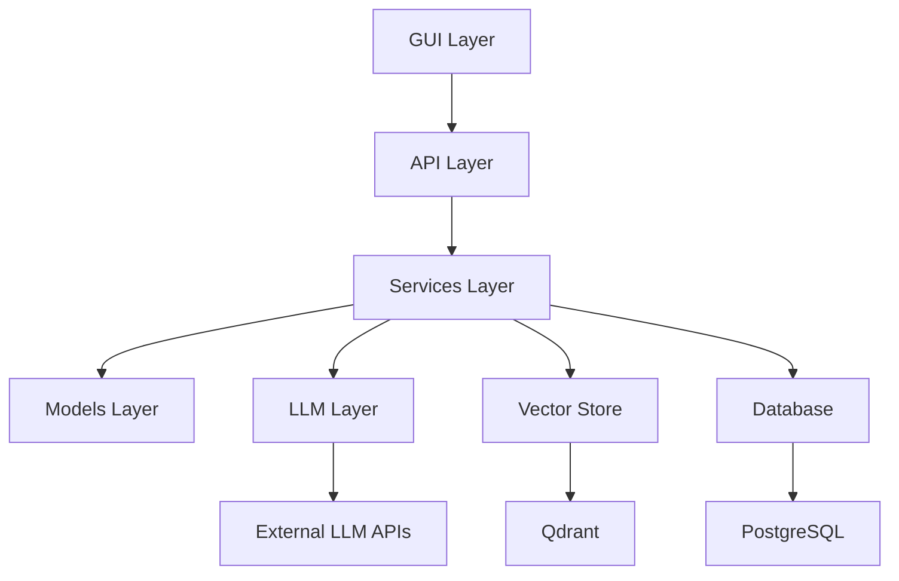

# Архитектурная документация AI Assistant MVP

## 🏗️ Общая архитектура

AI Assistant MVP построен по принципам **Hexagonal Architecture** (Ports & Adapters) и следует принципам **SOLID**.

```
┌─────────────────────────────────────────────────────────────┐
│                    AI Assistant MVP                         │
├─────────────────────────────────────────────────────────────┤
│  🌐 API Layer (FastAPI)                                     │
│  ├── app/main.py           # Точка входа приложения         │
│  ├── app/api/              # API маршруты                   │
│  │   ├── health.py         # Базовый health check           │
│  │   └── v1/               # API версии 1                   │
│  │       ├── health.py     # Расширенный health check       │
│  │       └── documents.py  # CRUD операции с документами    │
│  └── app/config.py         # Конфигурация приложения        │
├─────────────────────────────────────────────────────────────┤
│  🔄 Business Logic Layer                                    │
│  ├── services/             # Бизнес логика и оркестрация    │
│  │   └── document_service.py # Сервис управления документами│
│  └── models/               # Модели данных (Pydantic)       │
│      └── base.py           # Базовые модели и схемы         │
├─────────────────────────────────────────────────────────────┤
│  🧠 AI/ML Layer                                             │
│  ├── llm/                  # Интеграция с LLM               │
│  │   ├── base.py           # Базовые интерфейсы             │
│  │   ├── llm_loader.py     # Загрузчик LLM моделей          │
│  │   └── llm_plugins/      # Плагины для разных LLM         │
│  └── vectorstore/          # Векторное хранилище            │
├─────────────────────────────────────────────────────────────┤
│  💾 Data Layer                                              │
│  ├── database/             # SQL базы данных                │
│  └── core/cron/            # Фоновые задачи                 │
├─────────────────────────────────────────────────────────────┤
│  🖥️ Presentation Layer                                       │
│  └── gui/                  # Пользовательские интерфейсы    │
└─────────────────────────────────────────────────────────────┘
```

## 🔄 Поток данных

### 1. Создание документа
```
HTTP Request → API v1 → Document Service → In-Memory Store → Response
```

### 2. Поиск документов
```
Search Query → API v1 → Document Service → Text Matching → Scored Results
```

### 3. Будущий поток с AI
```
User Input → LLM Service → Vector Store → Document Generation → Storage
```

## 📁 Структура каталогов

### Основные каталоги

- **`app/`** - FastAPI приложение и API endpoints
- **`services/`** - Бизнес логика и use cases
- **`models/`** - Pydantic модели для валидации данных
- **`llm/`** - Интеграция с языковыми моделями
- **`vectorstore/`** - Векторные базы данных (Qdrant)
- **`database/`** - SQL базы данных (PostgreSQL)
- **`core/cron/`** - Фоновые задачи и автоматизация
- **`gui/`** - Пользовательские интерфейсы
- **`tests/`** - Тестирование (unit, integration, e2e)

### Конфигурационные файлы

- **`Makefile`** - Команды для сборки и развертывания
- **`docker-compose.yaml`** - Оркестрация контейнеров
- **`requirements.txt`** - Python зависимости
- **`.env.example`** - Шаблон переменных окружения

## 🔗 Зависимости между слоями



## 🎯 Принципы архитектуры

### 1. Разделение ответственности (SRP)
- Каждый модуль имеет единственную причину для изменения
- API слой отвечает только за HTTP интерфейс
- Services содержат только бизнес логику
- Models определяют только структуры данных

### 2. Инверсия зависимостей (DIP)
- Высокоуровневые модули не зависят от низкоуровневых
- Используются абстракции (интерфейсы) вместо конкретных реализаций
- DocumentServiceInterface позволяет легко менять реализации

### 3. Открытость/Закрытость (OCP)
- Код открыт для расширения, закрыт для модификации
- Новые типы документов добавляются через enum
- Новые LLM провайдеры подключаются через плагины

### 4. Принцип единственной ответственности
- FastAPI маршруты только обрабатывают HTTP
- Services только выполняют бизнес логику
- Models только валидируют данные

## 🔌 Порты и Адаптеры

### Порты (Interfaces)
- `DocumentServiceInterface` - абстракция для работы с документами
- `LLMInterface` - абстракция для языковых моделей
- `VectorStoreInterface` - абстракция для векторного поиска

### Адаптеры (Implementations)
- `InMemoryDocumentService` - в памяти для разработки
- `PostgreSQLDocumentService` - для продакшена (планируется)
- `OllamaLLMAdapter` - для локальных моделей
- `OpenAIAdapter` - для облачных моделей

## 🚀 Этапы развития архитектуры

### Текущее состояние (MVP v0.1)
- ✅ Базовая HTTP API
- ✅ In-memory хранилище документов
- ✅ Простой текстовый поиск
- ✅ Базовая валидация данных

### Следующие итерации
- 🔄 PostgreSQL интеграция
- 🔄 Qdrant векторный поиск
- 🔄 LLM интеграция (Ollama/OpenAI)
- 🔄 Semantic embeddings
- 🔄 Feedback система
- 🔄 Web GUI (Chainlit/Streamlit)

## 🛡️ Безопасность архитектуры

### Принципы безопасности
- Все секреты в переменных окружения
- Валидация входных данных через Pydantic
- Разделение конфигураций dev/prod
- Логирование всех операций

### Защитные слои
1. **HTTP слой**: Rate limiting, CORS
2. **API слой**: Валидация схем, аутентификация
3. **Service слой**: Бизнес правила, авторизация
4. **Data слой**: SQL инъекции, шифрование

## 📊 Метрики и мониторинг

### Health Checks
- `/health` - базовая проверка API
- `/api/v1/health` - расширенная проверка компонентов
- Проверка доступности внешних сервисов

### Логирование
- Структурированные логи (JSON)
- Разные уровни логирования по окружениям
- Централизованный сбор логов

### Производительность
- Async/await для I/O операций
- Connection pooling для БД
- Кэширование частых запросов 