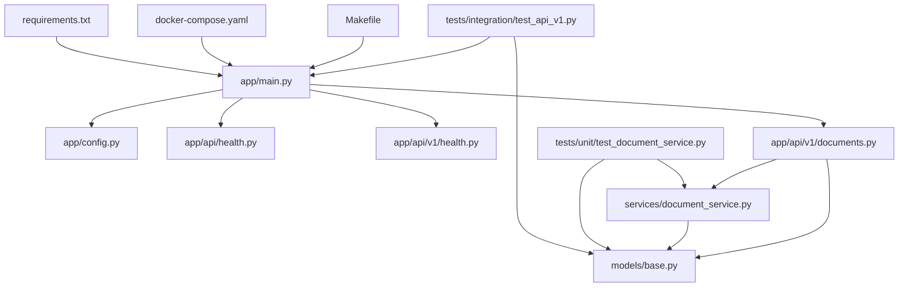

# Документация по файлам AI Assistant MVP

## 📂 Структура проекта

```
ai_assistant/
├── 📁 app/                     # FastAPI приложение
├── 📁 services/                # Бизнес логика
├── 📁 models/                  # Pydantic модели
├── 📁 llm/                     # LLM интеграция
├── 📁 vectorstore/             # Векторные БД
├── 📁 database/                # SQL БД
├── 📁 core/cron/               # Фоновые задачи
├── 📁 gui/                     # Пользовательские интерфейсы
├── 📁 tests/                   # Тестирование
├── 📁 docs/                    # Документация
├── 📄 Makefile                 # Команды сборки
├── 📄 docker-compose.yaml      # Оркестрация контейнеров
├── 📄 requirements.txt         # Python зависимости
├── 📄 .env.example             # Шаблон переменных окружения
├── 📄 .gitignore               # Игнорируемые файлы
├── 📄 README.md                # Основная документация
└── 📄 AGENTS.md                # Руководство для разработки
```

---

## 🌐 API Layer (app/)

### 📄 app/main.py
**Назначение**: Точка входа FastAPI приложения, конфигурация и запуск сервера.

**Основные компоненты**:
- `create_app()` - Фабрика FastAPI приложения
- `lifespan()` - Менеджер жизненного цикла (startup/shutdown)
- Подключение всех роутеров (health, documents)
- Настройка логирования

**Ключевые функции**:
```python
@asynccontextmanager
async def lifespan(app: FastAPI):
    # Startup logic
    yield
    # Shutdown logic

def create_app() -> FastAPI:
    # Создание и настройка FastAPI приложения
```

**Зависимости**:
- `app.config` - конфигурация приложения
- `app.api.health` - базовый health check
- `app.api.v1.health` - расширенный health check
- `app.api.v1.documents` - CRUD операции с документами

---

### 📄 app/config.py
**Назначение**: Централизованная конфигурация приложения с поддержкой переменных окружения.

**Основные компоненты**:
- `AppConfig` - dataclass с настройками приложения
- `from_env()` - загрузка конфигурации из переменных окружения
- Валидация настроек

**Конфигурационные параметры**:
```python
@dataclass
class AppConfig:
    host: str = "0.0.0.0"
    port: int = 8000
    environment: str = "development"
    debug: bool = False
    title: str = "AI Assistant MVP"
    version: str = "1.0.0"
    log_level: str = "INFO"
```

**Использование**:
```python
from app.config import config
app = FastAPI(title=config.title, version=config.version)
```

---

### 📄 app/api/health.py
**Назначение**: Базовый health check endpoint для мониторинга состояния API.

**Основные компоненты**:
- `HealthResponse` - Pydantic модель ответа
- `GET /health` - endpoint проверки состояния
- Отслеживание времени работы приложения

**Возвращаемые данные**:
- Статус сервиса
- Время работы (uptime)
- Версия приложения
- Окружение
- Базовые проверки компонентов

---

### 📄 app/api/v1/health.py
**Назначение**: Расширенный health check для API v1 с детальной проверкой компонентов.

**Отличия от базового**:
- Более детальные проверки компонентов
- Статус внешних сервисов (БД, vector store, LLM)
- API версионирование

**Проверяемые компоненты**:
```python
checks = {
    "api": "healthy",
    "database": "not_configured",
    "vectorstore": "not_configured", 
    "llm": "not_configured",
    "memory": "healthy"
}
```

---

### 📄 app/api/v1/documents.py
**Назначение**: RESTful API для управления документами (CRUD операции).

**Основные endpoints**:
- `POST /documents` - создание документа
- `GET /documents/{id}` - получение документа
- `PUT /documents/{id}` - обновление документа
- `DELETE /documents/{id}` - удаление документа
- `GET /documents` - список документов
- `POST /documents/search` - поиск документов

**Ключевые функции**:
```python
async def create_document(document: Document) -> Document
async def search_documents(query: SearchQuery) -> SearchResponse
async def update_document(document_id: str, document: Document) -> Document
```

**Зависимости**:
- `DocumentServiceInterface` - абстракция сервиса
- `InMemoryDocumentService` - конкретная реализация
- Pydantic модели для валидации

---

## 💼 Business Logic Layer

### 📄 models/base.py
**Назначение**: Базовые Pydantic модели для валидации данных и типизации.

**Основные модели**:

#### `Document`
```python
class Document(BaseModel):
    id: Optional[str] = None
    title: str
    content: str
    doc_type: DocumentType
    tags: List[str] = []
    metadata: Dict[str, Any] = {}
    created_at: Optional[datetime] = None
    updated_at: Optional[datetime] = None
```

#### `DocumentType` (Enum)
```python
class DocumentType(str, Enum):
    SRS = "srs"                 # System Requirements Specification
    NFR = "nfr"                 # Non-Functional Requirements
    USE_CASE = "use_case"       # Use Case Document
    RFC = "rfc"                 # Request for Comments
    ADR = "adr"                 # Architecture Decision Record
    DIAGRAM = "diagram"         # Diagram Document
```

#### `SearchQuery` & `SearchResult`
```python
class SearchQuery(BaseModel):
    query: str = Field(..., min_length=1, max_length=1000)
    limit: int = Field(default=10, ge=1, le=100)
    filters: Dict[str, Any] = {}

class SearchResult(BaseModel):
    document: Document
    score: float = Field(..., ge=0.0, le=1.0)
    highlights: List[str] = []
```

---

### 📄 services/document_service.py
**Назначение**: Бизнес логика для управления документами с применением принципов SOLID.

**Архитектурные компоненты**:

#### `DocumentServiceInterface` (Port)
Абстрактный интерфейс, определяющий контракт для работы с документами:
```python
class DocumentServiceInterface(ABC):
    @abstractmethod
    async def create_document(self, document: Document) -> Document
    @abstractmethod
    async def search_documents(self, query: SearchQuery) -> List[SearchResult]
    # ... другие методы
```

#### `InMemoryDocumentService` (Adapter)
Реализация для разработки и тестирования:
```python
class InMemoryDocumentService(DocumentServiceInterface):
    def __init__(self):
        self._documents: dict[str, Document] = {}
    
    async def create_document(self, document: Document) -> Document:
        # Генерация UUID, установка timestamps
        # Сохранение в in-memory словаре
```

**Особенности реализации**:
- Автоматическая генерация UUID для новых документов
- Управление временными метками (created_at, updated_at)
- Простой текстовый поиск с оценкой релевантности
- Поддержка фильтрации по типу документа
- Выделение фрагментов текста (highlights)

---

## 🧠 AI/ML Layer

### 📄 llm/base.py
**Назначение**: Базовые интерфейсы для интеграции с языковыми моделями.

**Содержимое**:
```python
from abc import ABC

class LLMInterface(ABC):
    # Базовый интерфейс для LLM
```

---

### 📄 llm/llm_loader.py
**Назначение**: Загрузчик и фабрика для различных LLM провайдеров.

**Функциональность**:
- Динамическая загрузка LLM моделей
- Поддержка различных провайдеров (Ollama, OpenAI)
- Конфигурация через переменные окружения
- Абстракция над различными API

**Основные функции**:
```python
def load_llm():
    # Загрузка LLM на основе конфигурации
```

---

## 🧪 Testing Layer

### 📄 tests/unit/test_document_service.py
**Назначение**: Unit тесты для сервиса управления документами.

**Тестируемые сценарии**:
- ✅ Создание документа
- ✅ Получение документа по ID
- ✅ Поиск документов
- ✅ Обновление документа
- ✅ Удаление документа
- ✅ Обработка ошибок (несуществующие документы)
- ✅ Фильтрация по типу документа

**Структура тестов**:
```python
class TestInMemoryDocumentService:
    @pytest.mark.asyncio
    async def test_create_document(self, document_service, sample_document):
        created_doc = await document_service.create_document(sample_document)
        assert created_doc.id is not None
        assert created_doc.created_at is not None
```

**Fixtures**:
- `document_service` - экземпляр сервиса для тестирования
- `sample_document` - образец документа для тестов

---

### 📄 tests/integration/test_api_v1.py
**Назначение**: Интеграционные тесты для API endpoints.

**Тестируемые endpoint'ы**:
- ✅ Health checks (`/health`, `/api/v1/health`)
- ✅ CRUD операции с документами
- ✅ Поиск документов
- ✅ Обработка ошибок (404, 400)
- ✅ Валидация входных данных

**Структура тестов**:
```python
class TestHealthEndpoints:
    def test_health_endpoint(self, client):
        response = client.get("/health")
        assert response.status_code == 200

class TestDocumentEndpoints:
    def test_create_document(self, client, sample_document_data):
        response = client.post("/api/v1/documents", json=sample_document_data)
        assert response.status_code == 201
```

**Test Client**:
```python
@pytest.fixture
def client():
    app = create_app()
    return TestClient(app)
```

---

## 🔧 Configuration & Infrastructure

### 📄 Makefile
**Назначение**: Автоматизация команд разработки и развертывания.

**Основные команды**:
```makefile
up:           # Запуск всех сервисов (Docker или локально)
down:         # Остановка сервисов
test:         # Запуск тестов с покрытием
healthcheck:  # Проверка состояния сервисов
run:          # Запуск в режиме разработки
```

**Логика выполнения**:
- Автоматическое определение наличия Docker
- Fallback на локальный запуск при отсутствии Docker
- Управление PID файлами для локальных процессов
- Интеграция с pytest для тестирования

---

### 📄 docker-compose.yaml
**Назначение**: Оркестрация контейнеров для полной инфраструктуры.

**Сервисы**:
```yaml
services:
  app:          # FastAPI приложение
  qdrant:       # Векторная база данных
  postgres:     # Реляционная база данных
  ollama:       # Локальная LLM
  web:          # Web интерфейс
```

**Особенности конфигурации**:
- Проброс портов для всех сервисов
- Volume mounting для разработки
- Переменные окружения из `.env.local`
- Зависимости между сервисами

---

### 📄 requirements.txt
**Назначение**: Спецификация Python зависимостей с версиями.

**Категории зависимостей**:

#### FastAPI и API
```
fastapi==0.110.0
uvicorn[standard]==0.29.0
pydantic==2.6.0
```

#### Базы данных
```
sqlalchemy==2.0.28
asyncpg==0.29.0
qdrant-client==1.7.3
```

#### LLM интеграция
```
openai==1.12.0
ollama==0.1.7
langchain==0.1.10
```

#### Тестирование
```
pytest==8.1.1
pytest-asyncio==0.23.5
pytest-cov==4.0.0
```

---

### 📄 .env.example
**Назначение**: Шаблон переменных окружения для безопасной конфигурации.

**Секции конфигурации**:
```bash
# Приложение
ENVIRONMENT=development
HOST=0.0.0.0
PORT=8000

# Базы данных
POSTGRES_HOST=localhost
QDRANT_HOST=localhost

# LLM
OLLAMA_HOST=localhost
OPENAI_API_KEY=your_key

# Безопасность
SECRET_KEY=change_this_key
```

---

## 📚 Documentation

### 📄 README.md
**Назначение**: Основная документация проекта для пользователей и разработчиков.

**Содержание**:
- 🎯 Цели и назначение проекта
- 🏗️ Архитектурный обзор
- 🚀 Инструкции по быстрому старту
- 📚 API документация
- 🧪 Инструкции по тестированию
- 🛠️ Команды разработки
- 🔧 Конфигурация окружения

---

### 📄 AGENTS.md
**Назначение**: Руководство для Codex и разработчиков по итеративной разработке.

**Содержание**:
- 📂 Архитектура проекта
- 🧱 Правила кодирования
- 🧪 Правила тестирования
- 🚀 Итерационный процесс
- 🔄 PR и ревью процесс
- 🔒 Принципы безопасности

---

### 📄 docs/ARCHITECTURE.md
**Назначение**: Детальная архитектурная документация системы.

**Содержание**:
- 🏗️ Общая архитектура (диаграммы)
- 🔄 Потоки данных
- 🎯 Принципы SOLID
- 🔌 Порты и адаптеры
- 🚀 Этапы развития

---

### 📄 docs/API_DOCS.md
**Назначение**: Полная документация REST API с примерами.

**Содержание**:
- 📋 Обзор API и базовые URL
- 🔍 Health check endpoints
- 📄 Document management API
- 📊 Модели данных (TypeScript interfaces)
- 🚨 Обработка ошибок
- 🧪 Примеры использования

---

## 🗂️ Planned Directories

### 📁 vectorstore/
**Назначение**: Адаптеры для векторных баз данных (Qdrant).
**Планируемые файлы**:
- `qdrant_client.py` - клиент Qdrant
- `embeddings.py` - генерация embeddings
- `vector_search.py` - семантический поиск

### 📁 database/
**Назначение**: SQL база данных и миграции.
**Планируемые файлы**:
- `models.py` - SQLAlchemy модели
- `migrations/` - Alembic миграции
- `connection.py` - подключение к БД

### 📁 core/cron/
**Назначение**: Фоновые задачи и автоматизация.
**Планируемые файлы**:
- `scheduler.py` - планировщик задач
- `retrain.py` - переобучение моделей
- `data_sync.py` - синхронизация данных

### 📁 gui/
**Назначение**: Пользовательские интерфейсы.
**Планируемые файлы**:
- `chainlit_app.py` - Chainlit интерфейс
- `streamlit_app.py` - Streamlit дашборд
- `templates/` - HTML шаблоны

---

## 🔄 Files Dependencies Graph



---

## 📊 Files Statistics

| Category | Files | Lines | Purpose |
|----------|-------|-------|---------|
| **API Layer** | 4 | ~300 | HTTP endpoints, routing |
| **Business Logic** | 2 | ~200 | Services, models |
| **Tests** | 2 | ~250 | Quality assurance |
| **Configuration** | 4 | ~100 | Infrastructure setup |
| **Documentation** | 5 | ~1000 | Project documentation |
| **Total** | 17 | ~1850 | Complete MVP implementation |

---

## 🎯 Code Quality Metrics

- **Test Coverage**: Target ≥ 80%
- **Type Hints**: 100% coverage
- **PEP8 Compliance**: Enforced
- **Documentation**: Comprehensive
- **Architecture**: SOLID principles
- **Security**: Environment-based secrets 