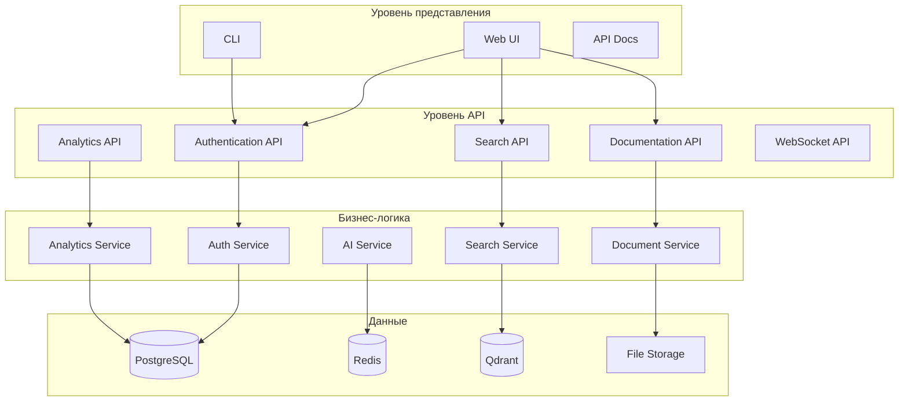
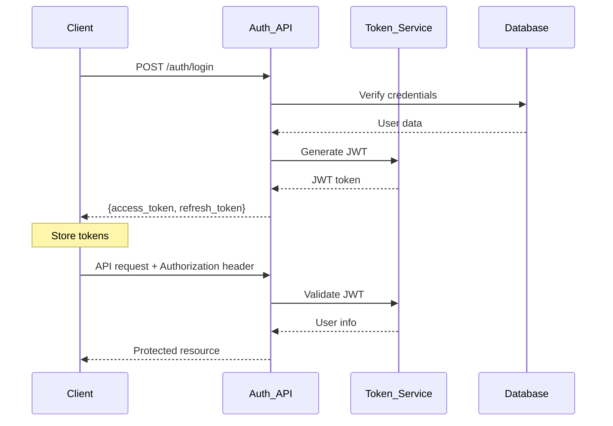
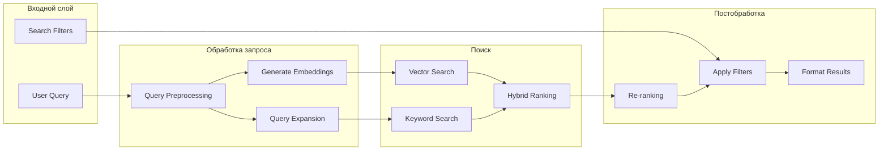
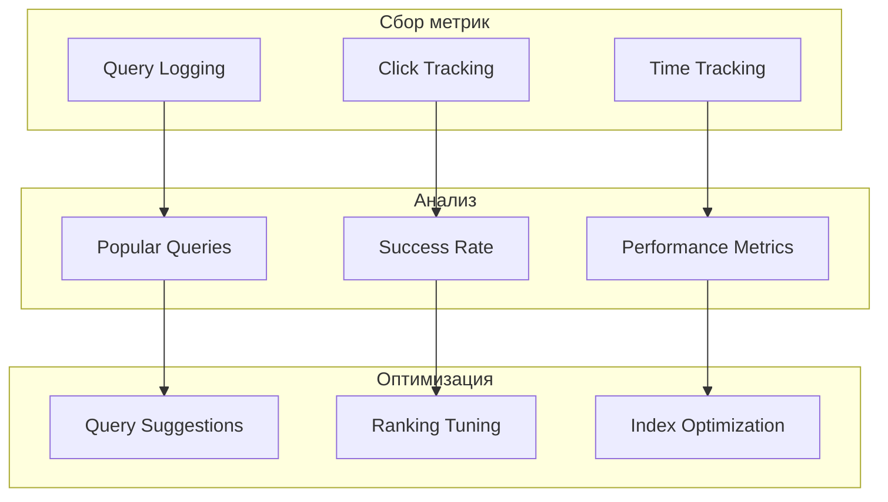
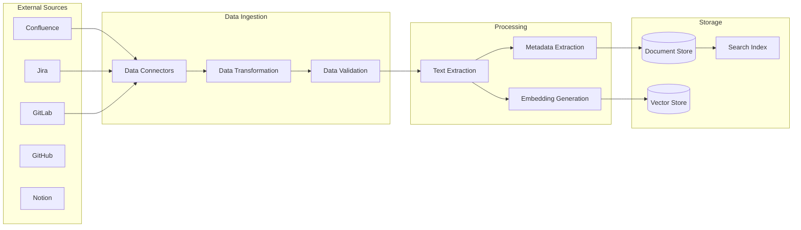
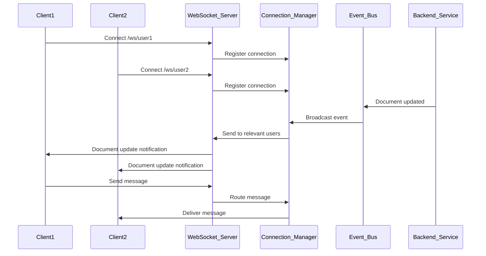
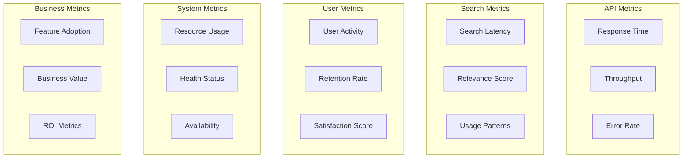

# 🤖 AI Assistant - Полное руководство по функциональности

**Версия:** 1.0.0  
**Дата:** 22 июня 2025 г.

## 📋 Содержание

1. [Обзор системы](#обзор-системы)
2. [Аутентификация и безопасность](#аутентификация-и-безопасность)
3. [Семантический поиск](#семантический-поиск)
4. [Генерация документации](#генерация-документации)
5. [Управление данными](#управление-данными)
6. [WebSocket и уведомления](#websocket-и-уведомления)
7. [Аналитика и мониторинг](#аналитика-и-мониторинг)
8. [Интеграции](#интеграции)
9. [API функциональность](#api-функциональность)

---

## 🌟 Обзор системы

AI Assistant - это комплексная платформа для управления знаниями, предоставляющая:

### Ключевые возможности

- **🔍 Семантический поиск** - Интеллектуальный поиск по документации с использованием AI
- **📝 Генерация RFC** - Автоматическое создание технических документов
- **🔐 Безопасность** - Многуровневая система аутентификации и авторизации
- **⚡ Real-time** - WebSocket уведомления и мониторинг в реальном времени
- **🔗 Интеграции** - Подключение к Confluence, Jira, GitLab
- **📊 Аналитика** - Детальная аналитика использования и производительности

### Архитектурные принципы



---

## 🔐 Аутентификация и безопасность

### Система аутентификации

#### 1. Базовая аутентификация

```python
# Регистрация нового пользователя
POST /api/v1/auth/register
{
    "email": "user@company.com",
    "password": "SecurePassword123!",
    "full_name": "John Doe"
}

# Вход в систему
POST /api/v1/auth/login
{
    "email": "user@company.com", 
    "password": "SecurePassword123!"
}
```

#### 2. JWT токены



#### 3. SSO интеграция

```python
# OAuth2 провайдеры
SUPPORTED_PROVIDERS = [
    "google",
    "microsoft", 
    "github",
    "okta"
]

# Инициация SSO
GET /api/v1/auth/sso/{provider}/login

# Callback обработка
GET /api/v1/auth/sso/{provider}/callback?code=...
```

### Управление разрешениями

```python
# Роли пользователей
class UserRole(Enum):
    VIEWER = "viewer"        # Только чтение
    EDITOR = "editor"        # Чтение + редактирование
    ADMIN = "admin"          # Полный доступ
    SUPER_ADMIN = "super_admin"  # Системный доступ

# Области доступа (scopes)
SCOPES = [
    "basic",              # Базовый доступ
    "search",             # Поиск документов
    "generate",           # Генерация документов
    "admin",              # Администрирование
    "analytics",          # Просмотр аналитики
    "integration"         # Управление интеграциями
]
```

### Безопасность API

```python
# Rate limiting
@rate_limit("100/minute")
async def search_endpoint():
    pass

# Input validation
class SearchRequest(BaseModel):
    query: str = Field(..., min_length=1, max_length=1000)
    filters: Optional[Dict] = Field(default_factory=dict)
    
# Cost control
@cost_limit(max_tokens=10000)
async def ai_generation():
    pass
```

---

## 🔍 Семантический поиск

### Поисковая архитектура



### Типы поиска

#### 1. Семантический поиск

```python
# Полнотекстовый семантический поиск
POST /api/v1/search/semantic
{
    "query": "Как настроить аутентификацию в микросервисной архитектуре?",
    "search_type": "semantic",
    "limit": 20,
    "include_snippets": true
}
```

#### 2. Гибридный поиск

```python
# Комбинирует семантический и keyword поиск
POST /api/v1/search/advanced/
{
    "query": "Docker deployment authentication",
    "search_type": "hybrid",
    "weights": {
        "semantic": 0.7,
        "keyword": 0.3
    },
    "filters": {
        "source_types": ["confluence", "gitlab"],
        "date_range": {
            "start": "2024-01-01T00:00:00Z",
            "end": "2024-12-31T23:59:59Z"
        }
    }
}
```

#### 3. Фильтрованный поиск

```python
# Поиск с множественными фильтрами
{
    "query": "API documentation",
    "filters": {
        "source_filters": {
            "confluence": ["TECH", "API"],
            "jira": ["PROJ-123", "PROJ-456"],
            "gitlab": ["backend-service", "api-gateway"]
        },
        "metadata_filters": {
            "authors": ["john.doe", "jane.smith"],
            "tags": ["api", "documentation", "guide"],
            "priority": ["high", "medium"],
            "language": ["en"]
        },
        "quality_filters": {
            "min_quality_score": 0.8,
            "min_relevance_score": 0.7
        },
        "content_filters": {
            "document_types": ["page", "issue", "merge_request"],
            "categories": ["documentation", "code", "requirements"],
            "file_extensions": [".md", ".rst", ".txt"]
        }
    }
}
```

### Поисковая аналитика



---

## 📝 Генерация документации

### AI-powered генерация

#### 1. RFC генерация

```python
POST /api/v1/generate/rfc
{
    "template_type": "technical_design",
    "context": {
        "project_name": "User Authentication Service",
        "description": "Implement OAuth2 authentication with JWT tokens",
        "requirements": [
            "Support multiple OAuth providers",
            "Token refresh mechanism", 
            "Role-based access control"
        ],
        "constraints": [
            "Must be backwards compatible",
            "Response time < 100ms"
        ]
    },
    "additional_context": "Previous implementations in confluence://TECH/auth-v1"
}
```

Результат:
```markdown
# RFC-001: User Authentication Service

## Summary
Implementation of OAuth2 authentication service with JWT tokens supporting multiple providers and RBAC.

## Motivation
Current authentication system lacks OAuth2 support and modern security practices...

## Design Overview
[Automatically generated based on context and requirements]

## API Specification
[Generated API documentation]

## Security Considerations
[AI-generated security analysis]

## Implementation Plan
[Step-by-step implementation guide]
```

#### 2. API документация

```python
POST /api/v1/generate/api-docs
{
    "endpoint": "/api/v1/users",
    "method": "POST", 
    "context": {
        "codebase_refs": ["gitlab://backend/users/api.py"],
        "related_docs": ["confluence://API/user-management"]
    }
}
```

#### 3. Код-ревью и улучшения

```python
POST /api/v1/generate/code-review
{
    "code_snippet": "...",
    "review_type": "security",
    "context": {
        "language": "python",
        "framework": "fastapi"
    }
}
```

### Шаблоны документов

```python
# Доступные шаблоны
DOCUMENT_TEMPLATES = {
    "rfc": {
        "technical_design": "Technical Design RFC",
        "api_specification": "API Specification RFC", 
        "security_review": "Security Review RFC",
        "architecture_decision": "Architecture Decision Record"
    },
    "documentation": {
        "api_guide": "API Integration Guide",
        "user_manual": "User Manual",
        "deployment_guide": "Deployment Guide",
        "troubleshooting": "Troubleshooting Guide"
    },
    "analysis": {
        "code_review": "Code Review Report",
        "security_audit": "Security Audit Report",
        "performance_analysis": "Performance Analysis"
    }
}
```

---

## 📊 Управление данными

### Источники данных



### Синхронизация данных

#### 1. Автоматическая синхронизация

```python
# Конфигурация синхронизации
{
    "confluence": {
        "spaces": ["TECH", "API", "DOCS"],
        "sync_frequency": "hourly",
        "filters": {
            "last_modified": "24h",
            "content_types": ["page", "blogpost"]
        }
    },
    "jira": {
        "projects": ["PROJ", "API"],
        "sync_frequency": "15min",
        "filters": {
            "status": ["Done", "In Progress"],
            "issue_types": ["Story", "Bug", "Epic"]
        }
    }
}
```

#### 2. Ручная синхронизация

```python
# Запуск синхронизации вручную
POST /api/v1/data-sources/sync
{
    "source_type": "confluence",
    "source_id": "confluence_main",
    "full_sync": false,
    "filters": {
        "spaces": ["TECH"],
        "since": "2024-06-01T00:00:00Z"
    }
}
```

### Управление документами

#### 1. CRUD операции

```python
# Создание документа
POST /api/v1/documents/
{
    "title": "API Integration Guide",
    "content": "# Guide content...",
    "source_type": "manual",
    "tags": ["api", "integration", "guide"],
    "metadata": {
        "author": "john.doe",
        "category": "documentation"
    }
}

# Получение документа
GET /api/v1/documents/{document_id}

# Обновление документа
PUT /api/v1/documents/{document_id}

# Удаление документа
DELETE /api/v1/documents/{document_id}
```

#### 2. Массовые операции

```python
# Массовое обновление тегов
POST /api/v1/documents/bulk-update
{
    "filters": {
        "source_type": "confluence",
        "space": "TECH"
    },
    "updates": {
        "add_tags": ["legacy"],
        "remove_tags": ["current"]
    }
}
```

---

## ⚡ WebSocket и уведомления

### WebSocket архитектура



### Типы уведомлений

#### 1. Системные уведомления

```javascript
// Подключение к WebSocket
const ws = new WebSocket('ws://localhost:8000/ws/user_123');

ws.onmessage = function(event) {
    const notification = JSON.parse(event.data);
    
    switch(notification.type) {
        case 'document_updated':
            handleDocumentUpdate(notification.data);
            break;
        case 'search_completed':
            handleSearchResult(notification.data);
            break;
        case 'system_alert':
            handleSystemAlert(notification.data);
            break;
    }
};

// Структура уведомления
{
    "type": "document_updated",
    "timestamp": "2025-06-22T01:00:00Z",
    "data": {
        "document_id": "doc_123",
        "title": "API Guide Updated",
        "author": "john.doe",
        "changes": ["content", "tags"]
    },
    "metadata": {
        "priority": "normal",
        "category": "content"
    }
}
```

#### 2. Персональные уведомления

```python
# Отправка персонального уведомления
POST /api/v1/notifications/send
{
    "user_id": "user_123",
    "type": "task_assigned",
    "message": "New RFC review assigned to you",
    "data": {
        "task_id": "task_456",
        "document_id": "rfc_789"
    },
    "channels": ["websocket", "email"]
}
```

#### 3. Групповые уведомления

```python
# Broadcast уведомление группе
POST /api/v1/notifications/broadcast
{
    "target": {
        "type": "role",
        "value": "admin"
    },
    "message": "System maintenance scheduled",
    "data": {
        "start_time": "2025-06-23T02:00:00Z",
        "duration": "2 hours"
    }
}
```

### WebSocket API

#### 1. Основные команды

```javascript
// Ping/Pong для проверки соединения
ws.send(JSON.stringify({
    type: 'ping',
    timestamp: Date.now()
}));

// Подписка на события
ws.send(JSON.stringify({
    type: 'subscribe',
    events: ['document_updates', 'search_results']
}));

// Отписка от событий
ws.send(JSON.stringify({
    type: 'unsubscribe',
    events: ['document_updates']
}));
```

#### 2. Статистика подключений

```python
GET /api/v1/ws/stats
{
    "total_connections": 45,
    "active_users": 32,
    "connections_by_type": {
        "web": 38,
        "mobile": 7
    },
    "events_sent_last_hour": 1250,
    "average_latency_ms": 15.3
}
```

---

## 📊 Аналитика и мониторинг

### Метрики производительности



### Дашборды аналитики

#### 1. Системная аналитика

```python
GET /api/v1/analytics/system
{
    "period": "24h",
    "metrics": [
        "api_requests_total",
        "api_response_time_avg",
        "error_rate", 
        "active_users",
        "search_queries_total"
    ]
}

# Response
{
    "period": "24h",
    "timestamp": "2025-06-22T01:00:00Z",
    "metrics": {
        "api_requests_total": 15420,
        "api_response_time_avg": 120.5,
        "error_rate": 0.02,
        "active_users": 234,
        "search_queries_total": 3580
    },
    "trends": {
        "api_requests_total": "+12%",
        "error_rate": "-5%"
    }
}
```

#### 2. Пользовательская аналитика

```python
GET /api/v1/analytics/users
{
    "period": "7d",
    "breakdown": "daily",
    "metrics": [
        "daily_active_users",
        "session_duration",
        "feature_usage",
        "user_retention"
    ]
}
```

#### 3. Аналитика поиска

```python
GET /api/v1/analytics/search
{
    "period": "7d",
    "metrics": [
        "popular_queries",
        "search_success_rate",
        "avg_search_time",
        "result_click_rate"
    ]
}

# Response
{
    "popular_queries": [
        {"query": "API authentication", "count": 245},
        {"query": "Docker deployment", "count": 189},
        {"query": "Database migration", "count": 156}
    ],
    "search_success_rate": 0.87,
    "avg_search_time": 340,
    "result_click_rate": 0.73
}
```

### Мониторинг в реальном времени

#### 1. Health checks

```python
GET /api/v1/monitoring/health
{
    "status": "healthy",
    "components": {
        "database": {
            "status": "healthy",
            "response_time": 12,
            "last_check": "2025-06-22T01:00:00Z"
        },
        "redis": {
            "status": "healthy", 
            "memory_usage": "45%",
            "connections": 12
        },
        "vector_db": {
            "status": "healthy",
            "collections": 3,
            "documents": 15420
        },
        "external_apis": {
            "openai": "healthy",
            "confluence": "healthy",
            "jira": "degraded"
        }
    }
}
```

#### 2. Performance monitoring

```python
GET /api/v1/monitoring/performance
{
    "current_load": {
        "cpu_usage": 35.5,
        "memory_usage": 68.2,
        "disk_usage": 45.8,
        "network_io": 15.3
    },
    "request_metrics": {
        "requests_per_second": 45.2,
        "avg_response_time": 120.5,
        "p95_response_time": 350.2,
        "error_rate": 0.02
    },
    "cache_metrics": {
        "hit_rate": 0.85,
        "miss_rate": 0.15,
        "eviction_rate": 0.05
    }
}
```

---

## 🔗 Интеграции

### Поддерживаемые системы

#### 1. Confluence

```python
# Конфигурация Confluence
{
    "base_url": "https://company.atlassian.net/wiki",
    "username": "service_account@company.com",
    "api_token": "api_token_here",
    "spaces": ["TECH", "API", "DOCS"],
    "sync_settings": {
        "frequency": "hourly",
        "include_attachments": true,
        "include_comments": false
    }
}

# Данные из Confluence
{
    "id": "confluence_123",
    "title": "API Authentication Guide",
    "content": "# Authentication...",
    "space": "TECH",
    "author": "john.doe",
    "created": "2024-01-15T10:00:00Z",
    "updated": "2024-06-20T15:30:00Z",
    "url": "https://company.atlassian.net/wiki/spaces/TECH/pages/123",
    "labels": ["api", "auth", "guide"],
    "attachments": [
        {
            "name": "auth-flow.png",
            "size": 45120,
            "mime_type": "image/png"
        }
    ]
}
```

#### 2. Jira

```python
# Конфигурация Jira
{
    "base_url": "https://company.atlassian.net",
    "username": "service_account@company.com", 
    "api_token": "api_token_here",
    "projects": ["PROJ", "API", "BUG"],
    "issue_types": ["Story", "Bug", "Epic", "Task"],
    "sync_settings": {
        "frequency": "15min",
        "include_comments": true,
        "include_attachments": false
    }
}

# Данные из Jira
{
    "id": "jira_PROJ_123",
    "key": "PROJ-123",
    "summary": "Implement OAuth2 authentication",
    "description": "Need to add OAuth2 support...",
    "issue_type": "Story",
    "status": "In Progress",
    "priority": "High",
    "assignee": "jane.smith",
    "reporter": "john.doe",
    "created": "2024-06-15T09:00:00Z",
    "updated": "2024-06-22T10:15:00Z",
    "labels": ["oauth", "authentication", "security"],
    "components": ["API", "Security"],
    "fix_versions": ["v2.1.0"]
}
```

#### 3. GitLab

```python
# Конфигурация GitLab
{
    "base_url": "https://gitlab.company.com",
    "access_token": "gitlab_token_here",
    "projects": [
        "backend/api-service",
        "frontend/web-app",
        "docs/technical-docs"
    ],
    "include_types": [
        "readme",
        "documentation", 
        "merge_requests",
        "issues"
    ],
    "sync_settings": {
        "frequency": "30min",
        "include_code_snippets": true,
        "max_file_size": "1MB"
    }
}

# Данные из GitLab
{
    "id": "gitlab_123",
    "type": "merge_request",
    "title": "Add OAuth2 authentication endpoint",
    "description": "Implementation of OAuth2...",
    "project": "backend/api-service",
    "author": "developer1",
    "created": "2024-06-20T14:00:00Z",
    "merged": "2024-06-21T16:30:00Z",
    "files_changed": [
        "src/auth/oauth.py",
        "tests/test_oauth.py",
        "docs/api/auth.md"
    ],
    "labels": ["authentication", "oauth", "api"]
}
```

### Кастомные интеграции

```python
# Создание кастомной интеграции
POST /api/v1/integrations/custom
{
    "name": "Internal Wiki",
    "type": "http_api",
    "config": {
        "base_url": "https://wiki.internal.com/api",
        "auth_type": "bearer",
        "auth_token": "token_here",
        "endpoints": {
            "list_pages": "/pages",
            "get_page": "/pages/{id}",
            "search": "/search"
        }
    },
    "mapping": {
        "id_field": "id",
        "title_field": "title",
        "content_field": "body",
        "author_field": "author.name",
        "updated_field": "updated_at"
    }
}
```

---

## 🚀 API функциональность

### REST API структура

```
/api/v1/
├── auth/                  # Аутентификация
│   ├── login             # POST - Вход
│   ├── logout            # POST - Выход
│   ├── refresh           # POST - Обновление токена
│   ├── register          # POST - Регистрация
│   └── sso/              # SSO интеграции
├── users/                # Управление пользователями
│   ├── profile           # GET/PUT - Профиль
│   ├── preferences       # GET/PUT - Настройки
│   └── activity         # GET - История активности
├── search/               # Поиск
│   ├── semantic          # POST - Семантический поиск
│   ├── advanced/         # POST - Расширенный поиск
│   ├── suggestions       # GET - Подсказки
│   └── history          # GET - История поиска
├── documents/            # Управление документами
│   ├── /                # GET/POST - Список/создание
│   ├── /{id}            # GET/PUT/DELETE - CRUD
│   ├── /{id}/versions   # GET - Версии документа
│   └── bulk-operations   # POST - Массовые операции
├── generate/             # AI генерация
│   ├── rfc              # POST - Генерация RFC
│   ├── api-docs         # POST - API документация
│   ├── code-review      # POST - Ревью кода
│   └── templates        # GET - Доступные шаблоны
├── data-sources/         # Управление источниками
│   ├── /                # GET/POST - Список/добавление
│   ├── /{id}/sync       # POST - Синхронизация
│   ├── /{id}/status     # GET - Статус синхронизации
│   └── configurations   # GET/PUT - Конфигурации
├── analytics/            # Аналитика
│   ├── dashboard        # GET - Основные метрики
│   ├── search           # GET - Аналитика поиска
│   ├── users            # GET - Пользовательская аналитика
│   └── reports          # GET - Отчеты
├── monitoring/           # Мониторинг
│   ├── health           # GET - Здоровье системы
│   ├── performance      # GET - Производительность
│   ├── metrics          # GET - Детальные метрики
│   └── alerts           # GET - Алерты
├── integrations/         # Интеграции
│   ├── /                # GET/POST - Список/создание
│   ├── /{id}/test       # POST - Тестирование
│   └── /{id}/sync       # POST - Синхронизация
└── ws/                  # WebSocket управление
    ├── stats            # GET - Статистика соединений
    └── broadcast        # POST - Отправка сообщений
```

### OpenAPI спецификация

```yaml
openapi: 3.0.3
info:
  title: AI Assistant API
  version: 1.0.0
  description: Comprehensive knowledge management and AI assistance platform

servers:
  - url: http://localhost:8000
    description: Development server
  - url: https://api.ai-assistant.company.com
    description: Production server

security:
  - BearerAuth: []

components:
  securitySchemes:
    BearerAuth:
      type: http
      scheme: bearer
      bearerFormat: JWT

paths:
  /api/v1/search/advanced/:
    post:
      summary: Advanced semantic search
      requestBody:
        required: true
        content:
          application/json:
            schema:
              $ref: '#/components/schemas/AdvancedSearchRequest'
      responses:
        '200':
          description: Search results
          content:
            application/json:
              schema:
                $ref: '#/components/schemas/SearchResponse'
```

---

## 🎯 Заключение

AI Assistant представляет собой комплексную платформу для управления знаниями с возможностями:

- **Интеллектуального поиска** с использованием семантических технологий
- **Автоматической генерации документации** с помощью AI
- **Безопасной аутентификации** и управления доступом
- **Real-time уведомлений** через WebSocket
- **Глубокой аналитики** использования и производительности
- **Гибких интеграций** с внешними системами

Система спроектирована для масштабирования и может обслуживать от небольших команд до крупных предприятий.

---

**Версия документации:** 1.0.0  
**Последнее обновление:** 22 июня 2025 г.  
**Поддерживается:** Development Team 