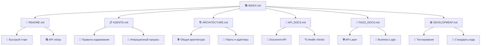

# 📚 Индекс документации AI Assistant MVP

Добро пожаловать в центральный индекс документации проекта AI Assistant MVP. Здесь вы найдете ссылки на все документы, которые помогут вам понять, использовать и развивать проект.

---

## 🏠 Основные документы

### 📖 [README.md](../README.md)
**Главная документация проекта**
- 🎯 Цели и назначение
- 🚀 Быстрый старт
- 🏗️ Архитектурный обзор
- 📚 API документация
- 🧪 Инструкции по тестированию

### 📋 [AGENTS.md](../AGENTS.md)
**Руководство для Codex и итеративной разработки**
- 📂 Структура проекта
- 🧱 Правила кодирования
- 🧪 Стандарты тестирования
- 🚀 Итерационный процесс
- 🔒 Принципы безопасности

---

## 🔧 Техническая документация

### 🏗️ [ARCHITECTURE.md](ARCHITECTURE.md)
**Детальная архитектурная документация**
- 🌐 Общая архитектура системы
- 🔄 Потоки данных
- 🎯 Принципы SOLID
- 🔌 Порты и адаптеры (Hexagonal Architecture)
- 🚀 Этапы развития архитектуры
- 🛡️ Безопасность архитектуры

### 📡 [API_DOCS.md](API_DOCS.md)
**Полная документация REST API**
- 📋 Обзор API и версионирование
- 🔍 Health check endpoints
- 📄 Document management API (CRUD)
- 📊 Модели данных (TypeScript interfaces)
- 🚨 Обработка ошибок
- 🧪 Примеры использования с curl

### 📁 [FILES_DOCS.md](FILES_DOCS.md)
**Документация по всем файлам проекта**
- 📂 Структура проекта
- 🌐 API Layer (FastAPI)
- 💼 Business Logic Layer
- 🧠 AI/ML Layer
- 🧪 Testing Layer
- 🔧 Configuration & Infrastructure
- 📊 Статистика и метрики файлов

### 🛠️ [DEVELOPMENT.md](DEVELOPMENT.md)
**Руководство для разработчиков**
- 🚀 Начало работы
- 📁 Структура разработки
- 🧪 Практики тестирования
- 🎨 Стандарты кодирования
- 🔄 Git workflow
- 🐛 Отладка и логирование

---

## 📊 Карта документации

---

## 🎯 Навигация по ролям

### 👨‍💻 Для разработчиков
1. **Начать здесь**: [README.md](../README.md) → [DEVELOPMENT.md](DEVELOPMENT.md)
2. **Архитектура**: [ARCHITECTURE.md](ARCHITECTURE.md)
3. **Файлы проекта**: [FILES_DOCS.md](FILES_DOCS.md)
4. **Правила разработки**: [AGENTS.md](../AGENTS.md)

### 🧪 Для тестировщиков
1. **API тестирование**: [API_DOCS.md](API_DOCS.md)
2. **Стратегия тестирования**: [DEVELOPMENT.md](DEVELOPMENT.md#практики-тестирования)
3. **Структура тестов**: [FILES_DOCS.md](FILES_DOCS.md#testing-layer)

### 🏗️ Для архитекторов
1. **Архитектурный обзор**: [ARCHITECTURE.md](ARCHITECTURE.md)
2. **Принципы проектирования**: [AGENTS.md](../AGENTS.md)
3. **Потоки данных**: [ARCHITECTURE.md](ARCHITECTURE.md#поток-данных)

### 📊 Для аналитиков
1. **Модели данных**: [API_DOCS.md](API_DOCS.md#data-models)
2. **Типы документов**: [FILES_DOCS.md](FILES_DOCS.md#document-model)
3. **API возможности**: [API_DOCS.md](API_DOCS.md#document-management-api)

### 🚀 Для DevOps
1. **Развертывание**: [README.md](../README.md#docker-services)
2. **Конфигурация**: [DEVELOPMENT.md](DEVELOPMENT.md#развертывание)
3. **Мониторинг**: [DEVELOPMENT.md](DEVELOPMENT.md#мониторинг-и-метрики)

---

## 📖 Типы документации

### 🎯 Пользовательская документация
- **README.md** - Общий обзор и быстрый старт
- **API_DOCS.md** - Руководство по использованию API

### 🔧 Техническая документация
- **ARCHITECTURE.md** - Архитектурные решения
- **FILES_DOCS.md** - Детали реализации
- **DEVELOPMENT.md** - Процессы разработки

### 📋 Процессная документация
- **AGENTS.md** - Стандарты и процедуры
- **INDEX.md** - Навигация и структура

---

## 🔍 Поиск информации

### По компонентам системы
- **FastAPI**: [FILES_DOCS.md](FILES_DOCS.md#api-layer-app) + [API_DOCS.md](API_DOCS.md)
- **Pydantic Models**: [FILES_DOCS.md](FILES_DOCS.md#modelsbasepy)
- **Services**: [FILES_DOCS.md](FILES_DOCS.md#servicesdocument_servicepy)
- **Tests**: [FILES_DOCS.md](FILES_DOCS.md#testing-layer)

### По задачам
- **Создать новый endpoint**: [DEVELOPMENT.md](DEVELOPMENT.md#добавление-нового-функционала)
- **Написать тесты**: [DEVELOPMENT.md](DEVELOPMENT.md#практики-тестирования)
- **Настроить окружение**: [README.md](../README.md#быстрый-старт)
- **Понять архитектуру**: [ARCHITECTURE.md](ARCHITECTURE.md)

### По типам файлов
- **Python код**: [FILES_DOCS.md](FILES_DOCS.md)
- **Конфигурация**: [FILES_DOCS.md](FILES_DOCS.md#configuration--infrastructure)
- **Docker**: [README.md](../README.md#docker-services)
- **Тесты**: [DEVELOPMENT.md](DEVELOPMENT.md#практики-тестирования)

---

## 📊 Статистика документации

| Документ | Размер | Назначение | Последнее обновление |
|----------|--------|------------|---------------------|
| README.md | ~500 строк | Основная документация | Текущая версия |
| AGENTS.md | ~328 строк | Руководство разработки | Базовая версия |
| ARCHITECTURE.md | ~200 строк | Архитектурные решения | Новый документ |
| API_DOCS.md | ~400 строк | API документация | Новый документ |
| FILES_DOCS.md | ~600 строк | Документация файлов | Новый документ |
| DEVELOPMENT.md | ~500 строк | Руководство разработчика | Новый документ |
| **Итого** | **~2500 строк** | **Полная документация** | **MVP v0.1** |

---

## 🔄 Обновление документации

### Принципы поддержки
- 📝 **Living Documentation** - документация обновляется вместе с кодом
- 🔄 **Версионирование** - документация следует версиям проекта
- 👥 **Коллективная ответственность** - все разработчики поддерживают документацию

### Процесс обновления
1. **При изменении API** → обновить [API_DOCS.md](API_DOCS.md)
2. **При добавлении файлов** → обновить [FILES_DOCS.md](FILES_DOCS.md)
3. **При изменении архитектуры** → обновить [ARCHITECTURE.md](ARCHITECTURE.md)
4. **При изменении процессов** → обновить [DEVELOPMENT.md](DEVELOPMENT.md)

---

## 🤝 Участие в развитии документации

### Как улучшить документацию
1. **Создайте issue** с предложением улучшения
2. **Форкните репозиторий** и внесите изменения
3. **Создайте Pull Request** с описанием изменений
4. **Пройдите review** от команды

### Стандарты документации
- ✅ **Markdown** для всех документов
- ✅ **Эмодзи** для улучшения читабельности
- ✅ **Ссылки** между документами
- ✅ **Примеры кода** с подсветкой синтаксиса
- ✅ **Диаграммы** через Mermaid где возможно

---

## 📞 Поддержка

### Где получить помощь
- 📋 **Issues** - для вопросов по документации
- 💬 **Discussions** - для обсуждения улучшений
- 📧 **Email** - для приватных вопросов
- 🤝 **Code Review** - для проверки изменений

### Контакты команды документации
- Техническая документация: Архитектурная команда
- API документация: Backend команда
- Пользовательская документация: Product команда

---

**Версия документации**: MVP v0.1  
**Последнее обновление**: Текущая дата  
**Статус**: Активная разработка 