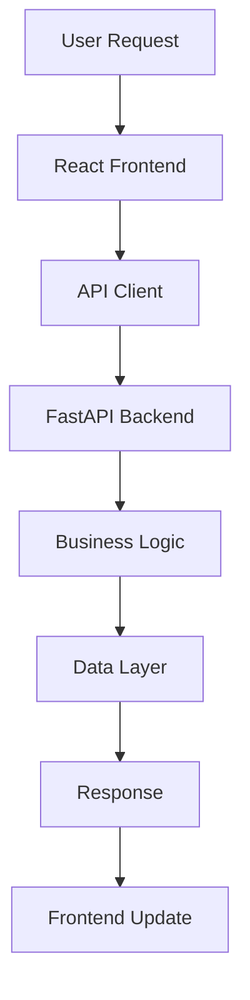
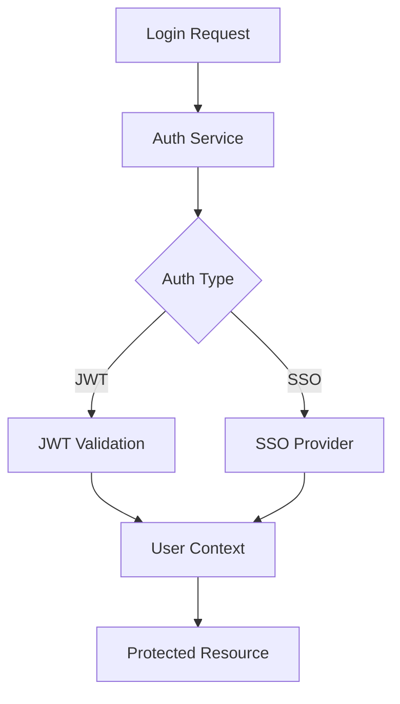
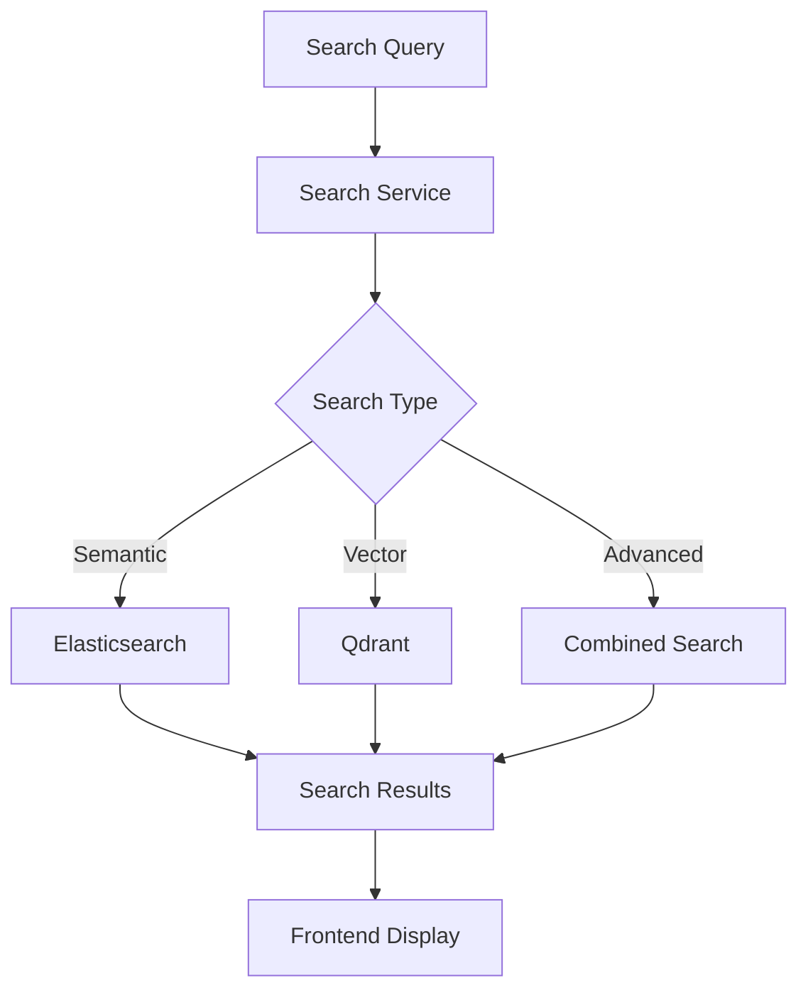
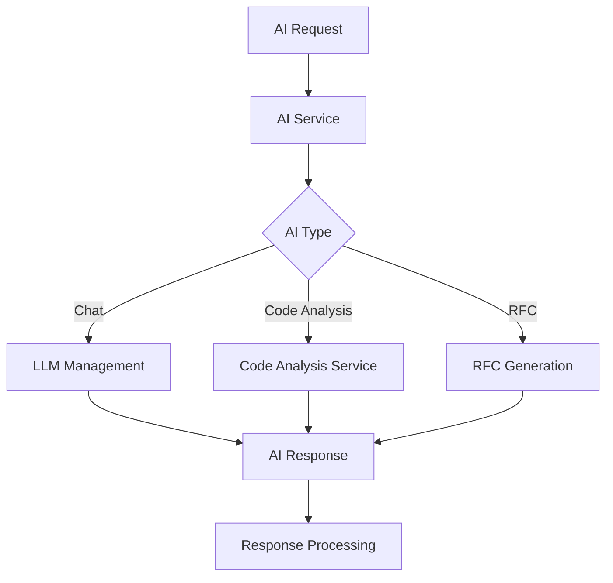

# 🏗️ AI Assistant MVP - Архитектура системы

**Версия:** 2.0  
**Дата актуализации:** 28 декабря 2024  
**Статус:** Актуализировано на основе реальной кодовой базы  

---

## 🎯 АРХИТЕКТУРНЫЙ ОБЗОР

### Общая архитектура
AI Assistant MVP построен на микросервисной архитектуре с четким разделением между frontend и backend компонентами. Система обеспечивает высокую производительность, масштабируемость и надежность.

```
┌─────────────────┐    ┌─────────────────┐    ┌─────────────────┐
│   Frontend      │    │   Backend       │    │   Data Layer    │
│   (React)       │◄──►│   (FastAPI)     │◄──►│   (Multi-DB)    │
│                 │    │                 │    │                 │
│ • React 18      │    │ • FastAPI       │    │ • PostgreSQL    │
│ • TypeScript    │    │ • Python 3.11   │    │ • Redis         │
│ • TailwindCSS   │    │ • Async/Await   │    │ • Qdrant        │
│ • Material-UI   │    │ • Pydantic v2   │    │ • Elasticsearch │
└─────────────────┘    └─────────────────┘    └─────────────────┘
```

### Ключевые архитектурные принципы
1. **Separation of Concerns**: Четкое разделение UI, бизнес-логики и данных
2. **API-First**: OpenAPI v8.0.0 спецификация с 180+ endpoints
3. **Async by Design**: Полностью асинхронная архитектура для высокой производительности
4. **Microservices Ready**: Модульная структура для будущего разделения на микросервисы
5. **Container Native**: Docker-first подход для всех компонентов

---

## 🔧 ТЕХНОЛОГИЧЕСКИЙ СТЕК

### Frontend Stack
```typescript
// Core Technologies
React 18.x          // UI фреймворк
TypeScript 5.x      // Типизация
TailwindCSS 3.x     // Styling
Material-UI v5      // UI компоненты

// State Management
React Context       // Глобальное состояние
React Query         // Server state
Zustand            // Client state

// Routing & Navigation
React Router v6     // SPA routing
React Hook Form     // Form management

// Development Tools
Vite               // Build tool
ESLint             // Linting
Prettier           // Code formatting
Playwright         // E2E testing
```

### Backend Stack
```python
# Core Framework
FastAPI 0.104.x     # Web framework
Python 3.11         # Language version
Pydantic v2         # Data validation
Uvicorn            # ASGI server

# Database & Storage
PostgreSQL 15       # Primary database
Redis 7.x          # Caching & sessions
Qdrant 1.x         # Vector database
Elasticsearch 8.x   # Search engine

# AI & ML
OpenAI API         # LLM integration
LangChain          # AI framework
Sentence Transformers # Embeddings
Hugging Face       # Model hub

# Monitoring & Observability
Prometheus         # Metrics collection
Grafana           # Metrics visualization
Structured Logging # JSON logs
Health Checks     # Service monitoring
```

### Infrastructure Stack
```yaml
# Containerization
Docker 24.x        # Containerization
Docker Compose     # Local orchestration
Multi-stage builds # Optimized images

# CI/CD
GitHub Actions     # CI/CD pipeline
pytest            # Testing framework
Coverage.py       # Code coverage
Security scanning # Vulnerability checks

# Deployment
Kubernetes        # Production orchestration
Nginx            # Reverse proxy
Let's Encrypt    # SSL certificates
```

---

## 🏛️ КОМПОНЕНТНАЯ АРХИТЕКТУРА

### Backend Architecture

#### API Layer
```
app/api/v1/
├── auth/                    # Аутентификация и авторизация
│   ├── auth.py             # JWT, login/logout
│   ├── users.py            # Управление пользователями
│   ├── sso.py              # SSO интеграции
│   └── user_settings.py    # Настройки пользователей
│
├── search/                  # Поиск и индексация
│   ├── search.py           # Базовый поиск
│   ├── search_advanced.py  # Расширенный поиск
│   ├── vector_search.py    # Векторный поиск
│   └── qdrant_vector_search.py # Qdrant интеграция
│
├── ai/                      # AI возможности
│   ├── ai_advanced.py      # Мультимодальный поиск
│   ├── ai_code_analysis.py # Анализ кода
│   ├── rfc_generation.py   # RFC генерация
│   ├── ai_optimization.py  # Оптимизация AI
│   ├── ai_agents.py        # AI агенты
│   ├── deep_research.py    # Глубокие исследования
│   ├── llm_management.py   # LLM управление
│   ├── ai_analytics.py     # AI аналитика
│   ├── core_optimization.py # Оптимизация ядра
│   └── learning.py         # Машинное обучение
│
├── monitoring/              # Мониторинг и аналитика
│   ├── analytics.py        # Аналитика
│   ├── performance.py      # Производительность
│   └── predictive_analytics.py # Предиктивная аналитика
│
├── realtime/               # Real-time функции
│   ├── websocket_endpoints.py # WebSocket API
│   ├── async_tasks.py      # Асинхронные задачи
│   ├── feedback.py         # Обратная связь
│   └── enhanced_feedback.py # Расширенная обратная связь
│
├── documents/              # Управление документами
│   └── documents.py        # CRUD операции
│
├── admin/                  # Административные функции
│   ├── configurations.py   # Конфигурации
│   ├── budget.py          # Управление бюджетом
│   ├── advanced_security.py # Продвинутая безопасность
│   └── test_endpoints.py   # Тестовые endpoints
│
└── data_sources.py         # Управление источниками данных
```

#### Core Services
```
app/
├── core/                   # Основные сервисы
│   ├── async_utils.py     # Async утилиты
│   ├── exceptions.py      # Обработка исключений
│   └── config.py          # Конфигурация
│
├── security/              # Безопасность
│   └── auth.py           # Аутентификация
│
├── models/               # Модели данных
│   ├── base.py          # Базовые модели
│   ├── search.py        # Модели поиска
│   └── auth.py          # Модели аутентификации
│
├── performance/          # Оптимизация производительности
│   ├── cache_manager.py  # Управление кэшем
│   └── database_optimizer.py # Оптимизация БД
│
└── monitoring/           # Мониторинг
    └── metrics.py        # Сбор метрик
```

### Frontend Architecture

#### Page Components
```
frontend/src/pages/
├── Dashboard.tsx           # Главная страница
├── Search.tsx             # Семантический поиск
├── VectorSearch.tsx       # Векторный поиск
├── Chat.tsx               # Чат-интерфейс
├── AdvancedAI.tsx         # Продвинутые AI функции
├── Generate.tsx           # RFC генерация
├── CodeDocumentation.tsx  # Генерация документации
├── DataSourcesManagement.tsx # Управление источниками
├── Analytics.tsx          # Базовая аналитика
├── AIAnalytics.tsx        # AI аналитика
├── Monitoring.tsx         # Мониторинг
├── RealtimeMonitoring.tsx # Real-time мониторинг
├── AIOptimization.tsx     # AI оптимизация
├── LLMOperations.tsx      # LLM операции
└── Settings.tsx           # Настройки
```

#### Shared Components
```
frontend/src/components/
├── common/                # Общие компоненты
│   ├── Layout.tsx        # Основной layout
│   ├── Navigation.tsx    # Навигация
│   ├── Header.tsx        # Заголовок
│   └── Footer.tsx        # Подвал
│
├── auth/                 # Аутентификация
│   ├── LoginForm.tsx     # Форма входа
│   ├── RegisterForm.tsx  # Форма регистрации
│   └── SSOButtons.tsx    # SSO кнопки
│
├── search/               # Поиск
│   ├── SearchBar.tsx     # Строка поиска
│   ├── SearchResults.tsx # Результаты поиска
│   ├── SearchFilters.tsx # Фильтры поиска
│   └── AdvancedSearchFilters.tsx # Расширенные фильтры
│
├── ai/                   # AI компоненты
│   ├── ChatInterface.tsx # Чат интерфейс
│   ├── CodeAnalysis.tsx  # Анализ кода
│   ├── RFCGenerator.tsx  # Генератор RFC
│   └── AIMetrics.tsx     # AI метрики
│
├── monitoring/           # Мониторинг
│   ├── MetricsDashboard.tsx # Дашборд метрик
│   ├── AlertsPanel.tsx   # Панель алертов
│   └── PerformanceCharts.tsx # Графики производительности
│
└── ui/                   # UI компоненты
    ├── Button.tsx        # Кнопка
    ├── Input.tsx         # Поле ввода
    ├── Modal.tsx         # Модальное окно
    ├── Card.tsx          # Карточка
    ├── Badge.tsx         # Бейдж
    ├── Alert.tsx         # Алерт
    └── Tabs.tsx          # Вкладки
```

#### Services & Utils
```
frontend/src/
├── api/                  # API клиенты
│   ├── apiClient.ts     # Основной API клиент
│   └── chatApi.ts       # Chat API
│
├── services/            # Бизнес логика
│   ├── api.ts          # API сервис
│   ├── auth.ts         # Аутентификация
│   └── websocket.ts    # WebSocket сервис
│
├── stores/             # Состояние приложения
│   ├── authStore.ts    # Состояние аутентификации
│   ├── searchStore.ts  # Состояние поиска
│   └── chatStore.ts    # Состояние чата
│
├── contexts/           # React контексты
│   ├── AuthContext.tsx # Контекст аутентификации
│   └── ThemeContext.tsx # Контекст темы
│
├── hooks/              # Пользовательские хуки
│   ├── useAuth.ts      # Хук аутентификации
│   ├── useApi.ts       # Хук для API
│   └── useWebSocket.ts # Хук для WebSocket
│
├── utils/              # Утилиты
│   ├── api.ts          # API утилиты
│   ├── validation.ts   # Валидация
│   └── formatting.ts   # Форматирование
│
└── types/              # TypeScript типы
    ├── api.ts          # API типы
    ├── auth.ts         # Типы аутентификации
    └── search.ts       # Типы поиска
```

---

## 🔄 DATA FLOW АРХИТЕКТУРА

### Request Flow


### Authentication Flow


### Search Flow


### AI Processing Flow


---

## 🔌 ВНЕШНИЕ ИНТЕГРАЦИИ

### AI Services
```python
# LLM Integrations
OpenAI API          # GPT-4, GPT-3.5-turbo
Anthropic Claude    # Claude-3
Azure OpenAI        # Enterprise GPT
Hugging Face       # Open source models

# Embedding Services
OpenAI Embeddings   # text-embedding-ada-002
Sentence Transformers # Local embeddings
Cohere Embeddings   # Multilingual embeddings
```

### Data Sources
```python
# Enterprise Integrations
Confluence API      # Documentation
Jira API           # Issue tracking
GitLab API         # Code repositories
SharePoint API     # Document management

# File Processing
PDF parsing        # Document extraction
Code analysis      # Source code parsing
Image processing   # OCR and analysis
```

### Infrastructure Services
```python
# Monitoring & Observability
Prometheus         # Metrics collection
Grafana           # Visualization
Sentry            # Error tracking
New Relic         # APM

# Security
Auth0             # Identity provider
Okta              # Enterprise SSO
Azure AD          # Microsoft integration
```

---

## 🔒 БЕЗОПАСНОСТЬ АРХИТЕКТУРЫ

### Authentication & Authorization
```python
# Security Stack
JWT Tokens         # Stateless authentication
RBAC              # Role-based access control
OAuth 2.0         # Third-party authentication
SAML 2.0          # Enterprise SSO

# Data Protection
TLS 1.3           # Transport encryption
AES-256           # Data at rest encryption
PBKDF2            # Password hashing
Rate Limiting     # API protection
```

### API Security
```python
# Request Validation
Pydantic v2       # Input validation
SQLAlchemy        # ORM protection
CORS              # Cross-origin protection
CSRF              # Cross-site request forgery protection

# Monitoring
Request logging   # Audit trail
Security headers  # HSTS, CSP, etc.
Input sanitization # XSS protection
```

---

## 📊 ПРОИЗВОДИТЕЛЬНОСТЬ АРХИТЕКТУРЫ

### Backend Performance
```python
# Async Architecture
FastAPI + Uvicorn # ASGI async server
Async/await       # Non-blocking I/O
Connection pooling # Database optimization
Background tasks  # Async processing

# Caching Strategy
Redis            # Application cache
Browser cache   # Static assets
API response cache # Query caching
CDN             # Global content delivery
```

### Frontend Performance
```typescript
// Optimization Techniques
Code splitting   // Lazy loading
Tree shaking    // Bundle optimization
Memoization     // React optimization
Virtual scrolling // Large lists
Image optimization // WebP, lazy loading

// Build Optimization
Vite            // Fast build tool
Bundle analysis // Size monitoring
Service Worker  // Offline support
PWA features    // App-like experience
```

### Database Performance
```sql
-- Optimization Strategies
Indexing         -- Query optimization
Connection pooling -- Resource management
Query optimization -- Performance tuning
Read replicas     -- Load distribution
Partitioning      -- Data distribution
```

---

## 🔄 SCALABILITY АРХИТЕКТУРЫ

### Horizontal Scaling
```yaml
# Container Orchestration
Kubernetes:
  - Pod autoscaling
  - Service mesh
  - Load balancing
  - Rolling updates

Docker Compose:
  - Multi-container setup
  - Service dependencies
  - Health checks
  - Resource limits
```

### Vertical Scaling
```yaml
# Resource Optimization
Memory:
  - Efficient data structures
  - Memory pooling
  - Garbage collection tuning
  - Caching strategies

CPU:
  - Async processing
  - Multi-threading
  - Process optimization
  - Algorithm efficiency
```

### Data Scaling
```yaml
# Database Scaling
PostgreSQL:
  - Read replicas
  - Partitioning
  - Connection pooling
  - Query optimization

Redis:
  - Clustering
  - Memory optimization
  - Persistence tuning
  - Eviction policies

Qdrant:
  - Vector indexing
  - Distributed deployment
  - Memory mapping
  - Query optimization
```

---

## 🔧 DEPLOYMENT АРХИТЕКТУРЫ

### Container Strategy
```dockerfile
# Multi-stage builds
FROM python:3.11-slim as base
# Dependencies layer
FROM base as dependencies
# Application layer
FROM dependencies as application
# Production layer
FROM application as production
```

### Environment Configuration
```yaml
# Environment-specific configs
Development:
  - Local databases
  - Debug logging
  - Hot reload
  - Mock services

Staging:
  - Production-like setup
  - Full logging
  - Performance testing
  - Integration testing

Production:
  - Optimized performance
  - Security hardening
  - Monitoring
  - Backup strategies
```

### Monitoring & Observability
```yaml
# Observability Stack
Metrics:
  - Prometheus
  - Custom metrics
  - Business metrics
  - Performance metrics

Logging:
  - Structured JSON logs
  - Centralized collection
  - Log aggregation
  - Error tracking

Tracing:
  - Request tracing
  - Performance profiling
  - Dependency mapping
  - Bottleneck identification
```

---

## 🎯 КАЧЕСТВЕННЫЕ АТРИБУТЫ

### Performance Targets
- **API Response Time**: < 150ms (достигнуто)
- **Search Performance**: < 2s (достигнуто ~1.5s)
- **Page Load Time**: < 1s
- **Throughput**: > 500 RPS (достигнуто 754.6 RPS)

### Reliability Targets
- **Uptime**: 99.9%
- **Error Rate**: < 1%
- **Recovery Time**: < 5 minutes
- **Data Consistency**: 100%

### Security Standards
- **OWASP Top 10**: Compliance
- **GDPR**: Ready
- **SOC 2**: Prepared
- **ISO 27001**: Aligned

### Maintainability
- **Code Coverage**: > 95%
- **Documentation**: Complete
- **API Versioning**: Semantic
- **Backward Compatibility**: Maintained

---

**Статус архитектуры:** ✅ Production Ready  
**Версия системы:** MVP 8.0 Enterprise  
**Последнее обновление:** 28 декабря 2024 