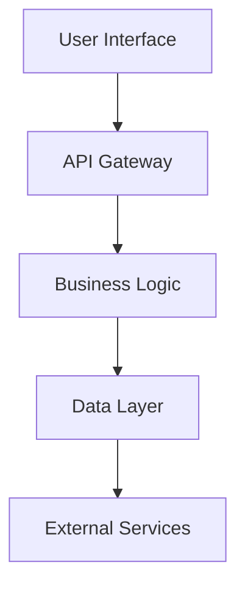

# Архитектура Создать Api Для Управления Пользователями

## Summary

Данный RFC описывает проектирование нового функционала для решения бизнес-задач, связанных с Создать API для управления пользователями с аутентификацией.

Предлагаемое решение основано на лучших практиках индустрии и учитывает специфические требования проекта.

## Context

### Текущая ситуация

Создать API для управления пользователями с аутентификацией

### Мотивация

Необходимость проектирование нового функционала обусловлена следующими факторами:
- Бизнес-требования к масштабируемость, интеграция, пользовательский опыт
- Технические ограничения текущего решения
- Потребности пользователей и стейкхолдеров

### Problem Statement

**Проблема:** Необходимо создать техническое решение, которое будет соответствовать бизнес-требованиям и обеспечит высокое качество пользовательского опыта.

**Критичность:** Высокая - решение напрямую влияет на ключевые метрики продукта.

### Current State

На данный момент:
- Анализ существующих решений проведен
- Выявлены ключевые требования и ограничения  
- Определены критерии успеха проекта

### Business Goals

**Основная бизнес-цель:** Обеспечить безопасное управление пользователями в микросервисной архитектуре

**Дополнительные цели:**
- Повышение операционной эффективности
- Улучшение пользовательского опыта
- Снижение технических рисков
- Обеспечение масштабируемости решения

## Goals

**Основные цели:**
- Реализация функционала согласно техническим требованиям
- Обеспечение высокой производительности и надежности
- Минимизация технического долга
- Создание масштабируемого решения

**Критерии успеха:**
- Соответствие функциональным требованиям
- Прохождение всех тестов качества
- Положительная обратная связь от пользователей

## Non-Goals

**Не входит в область решения:**
- Полная переработка существующей архитектуры (если не требуется)
- Решение проблем, не связанных с текущей задачей
- Оптимизация компонентов, которые работают корректно

## Proposed Architecture



Архитектура основана на принципах:
- **Modularity**: Четкое разделение ответственности
- **Scalability**: Горизонтальное масштабирование
- **Reliability**: Отказоустойчивость и мониторинг
- **Security**: Многоуровневая защита

### System Components

### Основные компоненты

1. **API Gateway**
   - Маршрутизация запросов
   - Аутентификация и авторизация
   - Rate limiting

2. **Business Logic Layer**
   - Обработка бизнес-логики
   - Валидация данных
   - Интеграция с внешними сервисами

3. **Data Access Layer**
   - Работа с базой данных
   - Кеширование
   - Аудит операций

### Data Flow

1. Пользователь отправляет запрос через клиентское приложение
2. API Gateway валидирует запрос и маршрутизирует его
3. Business Logic обрабатывает запрос и взаимодействует с данными
4. Результат возвращается пользователю через тот же путь

### API Design

### REST API Endpoints

```yaml
paths:
  /api/v1/resource:
    get:
      summary: Получить список ресурсов
      responses:
        200:
          description: Успешный ответ
    post:
      summary: Создать новый ресурс
      requestBody:
        required: true
        content:
          application/json:
            schema:
              $ref: '#/components/schemas/Resource'
```

### Security Considerations

**Безопасность данных:**
- Шифрование данных в покое и при передаче
- Аутентификация через OAuth 2.0/JWT
- Авторизация на основе ролей (RBAC)

**Защита от атак:**
- Rate limiting для предотвращения DDoS
- Валидация входных данных
- SQL injection protection
- XSS protection

**Аудит и мониторинг:**
- Логирование всех операций
- Мониторинг подозрительной активности
- Регулярные security audits

### Performance & Scalability

**Производительность:**
- Время отклика < 200ms для 95% запросов
- Пропускная способность > 1000 RPS
- Кеширование часто используемых данных

**Масштабируемость:**
- Horizontal scaling через контейнеризацию
- Load balancing между инстансами
- Auto-scaling на основе метрик нагрузки

**Мониторинг:**
- Real-time метрики производительности
- Alerting при превышении thresholds
- Performance profiling и optimization

## Implementation Plan

Реализация разбита на 3 основные фазы с итеративной разработкой и постоянной обратной связью.

### Phase 1: Core Infrastructure
**Длительность:** 2-3 недели

**Задачи:**
- Настройка инфраструктуры и CI/CD
- Реализация базовой архитектуры
- Создание API endpoints
- Базовые unit тесты

**Результат:** MVP с основным функционалом

### Phase 2: Feature Development  
**Длительность:** 3-4 недели

**Задачи:**
- Добавление расширенного функционала
- Интеграция с внешними сервисами
- Performance optimization
- Integration тесты

**Результат:** Feature-complete версия

### Phase 3: Integration & Testing
**Длительность:** 1-2 недели

**Задачи:**
- End-to-end тестирование
- Security testing
- Performance testing
- Production deployment

**Результат:** Production-ready решение

## Trade-offs & Alternatives

При проектировании рассматривались различные подходы с учетом trade-offs между производительностью, сложностью и стоимостью разработки.

### Considered Alternatives

1. **Монолитная архитектура**
   - Плюсы: Простота развертывания, меньше network overhead
   - Минусы: Сложность масштабирования, технологические ограничения

2. **Микросервисная архитектура**  
   - Плюсы: Независимое масштабирование, технологическое разнообразие
   - Минусы: Сложность инфраструктуры, network overhead

3. **Serverless подход**
   - Плюсы: Автоматическое масштабирование, оплата за использование
   - Минусы: Vendor lock-in, cold start latency

### Decision Rationale

Выбранное решение основано на балансе между:
- Требованиями к производительности
- Сложностью разработки и поддержки
- Бюджетными ограничениями
- Временными рамками проекта

## Impact Assessment

### Systems Affected
**Прямое влияние:**
- API Gateway
- User Management System
- Notification Service

**Косвенное влияние:**
- Monitoring System
- Logging Infrastructure
- CI/CD Pipeline

### Resource Requirements
**Development Team:**
- 2-3 Backend разработчика
- 1 Frontend разработчик  
- 1 DevOps инженер
- 0.5 QA инженера

**Infrastructure:**
- 2-3 production сервера
- Staging environment
- Development environment
- Monitoring и logging tools

### Risk Analysis
**Высокие риски:**
- Интеграция с legacy системами
- Performance bottlenecks при высокой нагрузке

**Средние риски:**
- Изменения в требованиях во время разработки
- Dependency на внешние сервисы

**Митигация:**
- Extensive testing на каждом этапе
- Fallback стратегии для внешних зависимостей
- Regular stakeholder communication

### Migration Strategy
**Поэтапная миграция:**
1. Parallel run с существующей системой
2. Gradual traffic switching (10% -> 50% -> 100%)
3. Monitoring и rollback plan

**Rollback план:**
- Automated rollback triggers
- Data consistency checks
- Communication plan

## Monitoring & Observability

**Метрики:**
- Request latency (p50, p95, p99)
- Error rate и success rate
- Throughput (RPS)
- Resource utilization (CPU, Memory)

**Alerting:**
- Error rate > 1%
- Latency p95 > 500ms
- Service availability < 99.9%

**Dashboards:**
- Real-time system health
- Business metrics
- Performance trends

## Testing Strategy

**Unit Testing:**
- Code coverage > 80%
- Mocking внешних зависимостей
- Fast feedback loop

**Integration Testing:**
- API contract testing
- Database integration tests
- External service integration

**End-to-End Testing:**
- Critical user journeys
- Performance testing
- Security testing

## Documentation

**Technical Documentation:**
- API documentation (OpenAPI/Swagger)
- Architecture diagrams
- Deployment guides

**User Documentation:**
- User guides
- Troubleshooting guides
- FAQ

**Operational Documentation:**
- Runbooks
- Monitoring guides
- Incident response procedures

## Success Metrics

**Technical Metrics:**
- API response time < 200ms (p95)
- System availability > 99.9%
- Error rate < 0.1%

**Business Metrics:**
- User adoption rate
- Feature usage statistics
- Customer satisfaction score

**Development Metrics:**
- Code quality metrics
- Deployment frequency
- Mean time to recovery

## Timeline

**Week 1-2:** Infrastructure setup, basic API
**Week 3-5:** Core functionality development
**Week 6-7:** Integration и testing
**Week 8:** Production deployment и monitoring

**Milestones:**
- [ ] Infrastructure ready (Week 2)
- [ ] MVP complete (Week 5)  
- [ ] Testing complete (Week 7)
- [ ] Production deployment (Week 8)

## Next Steps

- [ ] Technical design review
- [ ] Security architecture review
- [ ] Performance requirements validation
- [ ] Resource allocation approval
- [ ] Development kickoff

## Appendix

### References
- [GitHub Engineering RFCs](https://github.com/github/engineering-rfcs)
- [Stripe RFC Process](https://github.com/stripe/rfcs)
- [Architecture Decision Records](https://adr.github.io/)
- [System Design Principles](https://github.com/donnemartin/system-design-primer)

### Glossary
- **API Gateway**: Точка входа для всех API запросов
- **RFC**: Request for Comments - документ технического предложения
- **SLA**: Service Level Agreement - соглашение об уровне сервиса
- **RPS**: Requests Per Second - запросов в секунду

### Related Documents
- System Architecture Overview
- API Design Guidelines
- Security Policy
- Deployment Procedures

---

**Approval Process:**
- [ ] Architecture Review
- [ ] Security Review  
- [ ] Performance Review
- [ ] Final Approval

**Implementation Tracking:**
- [ ] Development Started
- [ ] Testing Complete
- [ ] Documentation Updated
- [ ] Deployed to Production 
